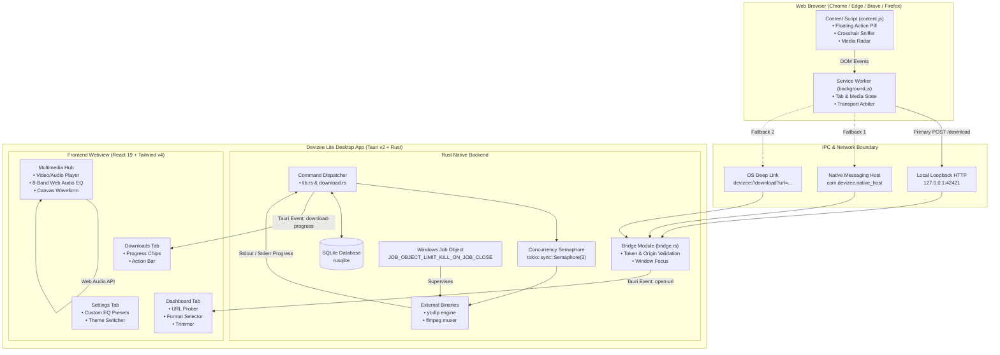

# Devizee Lite & Browser Extension — Master Project Brief (V3.0)

> **Document Status**: Single Source of Truth (SSOT)  
> **Audience**: AI generation engines, marketing copywriters, presentation creators, developers, technical recruiters, and open-source contributors.  
> **Rule for Downstream AIs**: Any document, README, presentation, LinkedIn post, Reddit post, video script, or sales deck must be derived exclusively from the facts, boundaries, and technical models specified in this brief. Never invent benchmarks, competitor specifics, or unverified claims.

---

## 1. Identity

### 1.1 Core Pitch & Summary
* **One-Line Pitch**: Devizee Lite is an ultra-fast, local-first, privacy-respecting media downloader and multimedia player for desktop, paired with an intelligent browser extension that captures video and audio without copy-pasting.
* **Three-Sentence Description**: Devizee bridges the gap between web browsing and desktop media archiving by pairing a Manifest V3 browser extension with a lightweight Tauri v2 and Rust desktop application. Users can grab streams from over 1,000 platforms via a floating action pill or an interactive crosshair element sniffer, relaying data strictly over local loopback (`127.0.0.1:42421`) with zero telemetry. With an integrated 8-band Web Audio equalizer, precision time-range trimming, subtitle extraction, and resilient auto-resume handling, Devizee provides a complete, ad-free multimedia toolkit on the user's local machine.

### 1.2 Target Personas
1. **Video Editors & Content Creators**: Creators who need specific 10-second meme clips, reaction clips, or sound bites from 3-hour live streams without wasting gigabytes of bandwidth and hours downloading the full file.
2. **Students, Academics & Researchers**: Individuals archiving educational lectures, webinars, and foreign-language tutorials who require high-resolution video and automated bilingual subtitle tracks (SRT / VTT).
3. **Everyday Media Consumers**: Users tired of deceptive "Download Now" buttons, intrusive pop-ups, crypto-miners, and malware traps on sketchy online downloader websites.
4. **Audiophiles & Music Curators**: Users who extract high-bitrate standalone audio (320kbps MP3, FLAC, WAV, Opus) and want an integrated desktop player equipped with a hardware-grade multi-band equalizer.
5. **Privacy Advocates**: Individuals who refuse to let third-party cloud proxy servers record their personal browsing habits, download history, and media preferences.

### 1.3 The Core Problem
The modern media downloading landscape is deeply fragmented and hostile to users:
* **The Web Downloader Trap**: Free online conversion sites rely on aggressive advertising, fake download triggers, misleading redirect loops, and tracking cookies. High-resolution streams (1080p, 4K, 60fps HDR) are typically gatekept behind subscription paywalls or throttled to sub-megabit speeds.
* **The CLI Tool Usability Barrier**: Pure command-line tools like `yt-dlp` and `ffmpeg` offer unmatched power and protocol coverage, but their command syntax, flag complexity, and absence of visual feedback alienate non-technical users.
* **The Traditional Download Manager Bloat**: Legacy tools like Internet Download Manager (IDM) or JDownloader are heavy, closed-source or Java-reliant, feature outdated UI paradigms, and lack built-in media previewing or audio equalization.
* **Fragile Web Connections**: Multi-gigabyte downloads regularly fail midway through on intermittent networks, leaving users with unreadable `.part` fragments and forcing them to start over from 0%.

### 1.4 Origin Story & Heritage
* **Developer**: Created by Touseef, an independent student software engineer.
* **Development History**: Initiated on September 20, 2026, progressing through over 112 git commits across intensive two-week sprints of architectural refinement and UI/UX optimization.
* **Philosophy**: Local-first architecture, zero external tracking, strict privacy on local loopback, and native desktop performance.

---

## 2. What It Does (Feature Inventory)

### 2.1 Desktop Application (Devizee Lite)
* **Stream Analyzer & Format Resolution Engine**: Automatically probes media links to extract available video resolutions (from 360p up to 4K / 8K HDR), bitrates, audio stream codecs, container types, and estimated file sizes. `[SHIPPED]`
* **Precision Time-Range Trimming**: Interactive slider controls and timestamp inputs (HH:MM:SS) allow users to specify arbitrary start and end times, instructing the engine to extract only that specific section. `[SHIPPED]`
* **Audio Extraction & Conversion**: One-click extraction of video streams into audio containers with automatic metadata tagging: MP3 (up to 320 kbps), M4A (AAC), FLAC (Lossless), WAV, and Opus. `[SHIPPED]`
* **Subtitle Downloader**: Automated detection and extraction of both author-uploaded and platform-generated subtitles in standard `.srt` and `.vtt` formats across all published languages. `[SHIPPED]`
* **Batch URL Importer & Text Loader**: Modal for queuing dozens of links simultaneously via raw text pasting or `.txt` file imports with automated URL deduplication and normalization. `[SHIPPED]`
* **Playlist & Channel Unroller**: Automatically parses playlist URLs and channel indexes into a selectable item list, enabling selective individual downloads or full batch execution. `[SHIPPED]`
* **Download Scheduling**: Supports deferred scheduling with quick preset triggers ("In 1 Hour", "Tonight 2 AM", "Tomorrow 8 AM") as well as an exact local datetime picker. `[SHIPPED]`
* **Multi-Theme Engine**: 4 handcrafted aesthetic themes synced across desktop and extension: *Signature Dark* (obsidian with indigo accents), *OLED Pure Black* (`#000000` for OLED efficiency), *Frost Slate* (cool cyan/slate), and *Daylight Clean* (high-contrast light mode). `[SHIPPED]`
* **Bandwidth & Concurrency Limiting**: Frontend settings interface for setting concurrent connection caps and download speed ceilings. `[PARTIAL]`

### 2.2 Browser Extension (Devizee Companion)
* **Floating Action Grabber Pill**: Non-intrusive floating control rendered directly in the corner of active media pages with modern vector SVG iconography. Displays real-time detected stream counts and allows one-click capture. `[SHIPPED]`
* **Interactive Crosshair Element Sniffer**: Clicking the sniffer reticle transforms the cursor into a targeting crosshair. Hovering over any DOM video, audio element, or media hyperlink displays a highlighted border with contextual badges (`[VIDEO]`, `[AUDIO]`, `[MEDIA LINK]`). Clicking beams the stream to desktop; pressing `Esc` exits cleanly. `[SHIPPED]`
* **Multi-Media Scanner & "Now Playing" Radar**: Scans complex pages (social feeds, galleries, message boards) for all embedded streams. Actively monitors HTML5 media playback state and applies an animated green pulsing "PLAYING" badge to currently running video. `[SHIPPED]`
* **Batch Relay ("Queue All")**: A single click dispatches all detected media on the current page to Devizee Desktop in sequential order. `[SHIPPED]`
* **Toolbar Stream Counter**: Extension icon displays a dynamic numeric badge reflecting the count of downloadable media streams on the active tab. `[SHIPPED]`
* **Local Loopback Communication**: Sends HTTP POST requests directly to `http://127.0.0.1:42421/download`. If the desktop app is offline, falls back gracefully to Native Messaging and the `devizee://` custom protocol handler. `[SHIPPED]`

### 2.3 Reliability & Resilience
* **Fault-Tolerant Auto-Resume**: Uses `.part` buffer files to automatically resume interrupted transfers right where they stopped without restarting from zero bytes. `[SHIPPED]`
* **Expired CDN Token Recovery ("Refresh URL")**: Resolves expiring CDN download links on massive files via a dedicated modal that swaps in fresh session tokens while retaining already-downloaded chunks. `[SHIPPED]`
* **Windows Job Object Containment**: Parent Tauri process assigns worker processes to a Windows Job Object configured with `JOB_OBJECT_LIMIT_KILL_ON_JOB_CLOSE`, ensuring zero orphaned background processes if the app exits. `[SHIPPED]`
* **Sleep/Wake Jump Detection**: Monitors monotonic clock deltas. If a system sleep/hibernate jump is detected (>15s), the app cleanly interrupts active tasks to prevent socket hangs and data corruption. `[SHIPPED]`
* **Path Traversal Security**: Strict canonical path validation ensures file read/write operations cannot escape designated application download directories. `[SHIPPED]`
* **One-Click Engine Self-Updater**: Built-in engine updater downloads the latest extractor release directly from GitHub releases to stay ahead of platform streaming protocol changes. `[SHIPPED]`

### 2.4 Multimedia Hub & Player
* **Integrated Native Media Player**: Plays downloaded audio and video files directly inside the application without requiring VLC or third-party players. `[SHIPPED]`
* **8-Band Web Audio Equalizer**: Real-time multi-band filtering (60Hz, 150Hz, 400Hz, 1kHz, 2.4kHz, 6kHz, 12kHz, 16kHz) with smooth parametric gain transitions. `[SHIPPED]`
* **Curated Equalizer Profiles**: Includes Bass Boost, Vocal Clarity, Electronic, Rock, Acoustic, Flat, and Volume Booster (+4dB). `[SHIPPED]`
* **User-Defined Custom Presets**: Allows users to save, name, and delete their own custom equalizer profiles, persisted in local storage. `[SHIPPED]`
* **Hardware Audio Device Output Routing**: Supports dynamic selection of physical audio playback output devices. `[SHIPPED]`
* **Zero-CPU Waveform Visualizer**: Smooth animated canvas visualization during active playback that idles immediately upon pause to conserve battery. `[SHIPPED]`

---

## 3. Unique Selling Points (USPs)

| # | Unique Selling Point | Why the User Cares | How It Is Built (1 Line) |
|---|---|---|---|
| **1** | **One-Click Browser-to-Desktop Relay** | No more copying links, switching windows, and pasting. Click the floating pill or use the crosshair sniffer and it's queued. | Extension dispatches to desktop via local loopback HTTP (`127.0.0.1:42421`) or custom OS URI scheme. |
| **2** | **Zero Telemetry & 100% Local Privacy** | Your viewing habits, downloading history, and IP address are never exposed to remote analytical or proxy servers. | Built with zero telemetry SDKs; all network operations run strictly on local loopback and direct CDN pipes. |
| **3** | **Interactive Precision Range Trimmer** | Saves gigabytes of bandwidth and minutes of waiting by downloading only the exact 30 seconds or 2 minutes you need. | Native slider UI sends start/end time offsets directly to the underlying streaming extraction engine. |
| **4** | **Studio Audio Extraction + 8-Band Hardware EQ** | Convert video to 320kbps MP3 or lossless FLAC and listen immediately with custom sound tuning. | Biquad filter node chains connected via the browser Web Audio API inside the Tauri webview. |
| **5** | **Zero-Adware, Zero-Scam Desktop Experience** | Eliminates dangerous popup malware, spoofed download links, and speed throttle paywalls permanently. | Open-source, compiled native Rust executable with strict CSP and zero commercial ad networks. |
| **6** | **Industrial Process Containment (Zero Ghosts)** | If the app closes or crashes, your computer isn't slowed down by zombie extraction tasks eating CPU in the background. | Enforced by the Windows Win32 Job Object API with `JOB_OBJECT_LIMIT_KILL_ON_JOB_CLOSE`. |
| **7** | **Expired CDN Token Refresh** | You never lose 90% progress on a 10GB download when the server's temporary access token expires. | Interactive URL refresh prompt swaps connection tokens while writing sequentially to the existing `.part` file. |

### Comparative Landscape

* **vs. Online Downloader Websites**: Free web downloaders are riddled with deceptive advertisements, malicious popunders, resolution caps at 720p, and privacy-invasive analytics. Devizee is clean, local, uncapped (4K/8K), and completely free.
* **vs. Raw CLI Wrappers (yt-dlp GUI)**: Most yt-dlp GUIs are thin, utilitarian wrappers with unstyled form inputs, prone to crashing on missing dependencies. Devizee offers a consumer-grade React 19 UI, integrated player, audio EQ, and seamless browser companion.
* **vs. Traditional Download Managers (IDM / JDownloader)**: Legacy download managers rely on dated UI frameworks or heavy Java runtimes, require complex browser installation configurations, and lack built-in media players. Devizee is lightweight (~30MB idle RAM [ESTIMATE]), modern, and includes a full multimedia companion.
* **vs. Generic Chrome Video Downloader Extensions**: Web Store extensions cannot bundle native extraction tools due to browser sandbox limits and are restricted by store policies on major video sites. Devizee uses the extension merely as a lightweight sniffer, delegating the heavy extraction to the native desktop engine.

### Where Devizee Is NOT Better (Honest Trade-offs)
* **No Multi-Segment HTTP Acceleration (Yet)**: For static direct file downloads (e.g., raw ISOs or large ZIP files), tools like IDM utilize 16x–32x segmented HTTP chunking. Devizee Lite uses standard streaming extraction pipelines (multi-segment engine is planned for Pro).
* **No BitTorrent / Magnet Engine**: Devizee Lite does not download P2P torrent swarms.
* **Platform Dependent on Upstream Extractors**: When major streaming platforms change their video signature algorithms, extraction may fail temporarily until the engine is refreshed via the self-updater.
* **Desktop App Must Be Running**: The browser extension cannot download standalone media on its own; it requires the desktop app to receive and execute tasks.

---

## 4. Engineering Deep Dive

### 4.1 Tech Stack Matrix

| Layer | Technology | Version | Rationale |
|---|---|---|---|
| **App Shell** | Tauri | v2.12 | Native OS shell providing ultra-small binary sizes, native OS API bindings, and minimal RAM footprint compared to Electron. |
| **Core Backend** | Rust | 2021 Edition | Memory safety, zero-cost abstractions, multi-threaded process control, and native Windows API interop. |
| **Frontend Framework** | React | v19.1 | Declarative component architecture for real-time reactivity and state management across complex UI tabs. |
| **Type System** | TypeScript | ~v6.0 | Strict static typing ensuring zero runtime type discrepancies between backend events and UI states. |
| **Build Tooling** | Vite | v8.0 | Instant HMR development and hyper-optimized production bundling. |
| **Styling Engine** | Tailwind CSS | v4.3 | Zero-runtime CSS generation with high-performance CSS variable theming. |
| **Database** | SQLite (`rusqlite`) | v0.31 | Bundled, serverless, atomic SQL database ensuring fast persistence of history, settings, and queue states. |
| **Process Control** | `windows-sys` | v0.52 | Direct Win32 API access to Windows Job Objects and system process hierarchies. |
| **Audio Processing** | Web Audio API | Standard | Native browser-level BiquadFilterNode DSP pipelines for multi-band audio equalization. |
| **Browser Extension** | WebExtensions | Manifest V3 | Standardized browser extension API supported across all major Chromium and Gecko browsers. |

### 4.2 System Architecture & IPC Data Flow

### 4.3 The Extension-to-Desktop Bridge
* **Loopback Protocol & Port**: Desktop app hosts an embedded HTTP listener on `127.0.0.1:42421` (Lite tier; port `42422` reserved for Pro).
* **Security & Authentication Model**:
  1. *Origin Header Verification*: The server inspects incoming `Origin` headers. Requests originating from browser extensions (`chrome-extension://` or `moz-extension://`) or headless direct service workers (`null` / direct loopback) are allowed. Cross-origin requests from public websites attempting to abuse loopback are immediately rejected with `403 Forbidden`.
  2. *Secret Token Validation*: On application initialization, Devizee generates a cryptographically random 32-character hexadecimal token saved locally to `%LOCALAPPDATA%\Devizee\bridge_token`. The extension or companion processes pass this via `X-Devizee-Token`.
  3. *DRM Filtering*: URLs matching known hardware-encrypted DRM services are intercepted and rejected early before spawning extraction routines.
* **Offline Fallback Cascade**: If the desktop app is closed when the user triggers a download:
  1. `fetch("http://127.0.0.1:42421/download")` times out after 1500ms.
  2. Extension attempts `chrome.runtime.sendNativeMessage("com.devizee.native_host", ...)`.
  3. If native messaging host is unregistered, extension falls back to opening `devizee://download?url=<ENCODED_URL>`, which instructs Windows to launch the desktop application and register the payload.

### 4.4 Concurrency, Process Management & Reliability
* **Concurrency Control**: Download task execution is throttled via an asynchronous `tokio::sync::Semaphore` set to 3 concurrent worker tasks. Overflow tasks wait in a `Queued` state in SQLite.
* **Process Supervison via Win32 Job Objects**: Worker child processes (`yt-dlp` and `ffmpeg`) are explicitly registered to a Win32 Job Object handle with `JOB_OBJECT_LIMIT_KILL_ON_JOB_CLOSE`. If the Tauri process terminates unexpectedly or is terminated via Task Manager, the operating system kernel instantly cascades process termination to all spawned subprocesses.
* **State Persistence**:
  * Persistent download records, status flags, timestamps, and target paths reside in a local SQLite database (`rusqlite`) in WAL mode.
  * User preferences (selected theme, volume levels, custom equalizer presets) reside in `localStorage`.
* **Reliability Engineering**:
  * *Partial File Resumption*: Downloads write to `.part` files. Re-triggering a paused or failed task reads existing byte lengths and requests byte-range resumption from the host server.
  * *Clock Jump Recovery*: Monotonic clock sampling detects system sleep/wake cycles (>15 second jump), proactively switching active downloads to an `Interrupted` status to prevent corrupted file writes.

### 4.5 Engineering Trade-offs & Hard Problems Solved

| Problem | Technical Solution | Trade-off / Rationale |
|---|---|---|
| **Zombie Background Processes** | Assigned all spawned extraction tasks to Windows Win32 Job Objects via `windows-sys` (`JOB_OBJECT_LIMIT_KILL_ON_JOB_CLOSE`). | Windows-specific API dependency; guarantees zero orphan background tasks on app shutdown or crash. |
| **Electron RAM Bloat** | Migrated application shell to Tauri v2 (Rust + native OS Webview). | Requires platform-specific webviews (WebView2 on Windows), reducing idle RAM from ~150MB+ to ~30MB [ESTIMATE]. |
| **Expired Video CDN Tokens** | Implemented interactive "Refresh URL" flow to update session tokens on existing `.part` files. | Requires user interaction to re-fetch URL, but saves gigabytes of downloaded progress. |
| **Extension Loopback Abuse** | Validated `Origin` headers against extension schemes (`chrome-extension://`, `moz-extension://`) and checked local auth tokens (`%LOCALAPPDATA%\Devizee\bridge_token`). | Adds token handshake complexity, but prevents malicious web pages from executing unauthorized local downloads. |
| **Audio Distortion & Crashes in EQ** | Clamped gain sliders between -12dB and +12dB, used `setTargetAtTime` parametric ramps (30ms), and pruned orphaned Biquad nodes on media `emptied` events. | Eliminates audio pops, clicks, and memory leaks from orphaned Web Audio nodes. |
| **Equalizer Audio vs. Video Disconnect** | Root Cause: `<video>` element was conditionally rendered only when active, leaving `videoRef.current` null on startup and bypassing Web Audio node attachment. Fix: Permanently mount `<video>` in DOM (hidden via CSS when inactive), re-binding the Web Audio filter graph on mount, `onLoadedData`, and deferred play. | Keeps a permanent DOM node active, but guarantees seamless audio equalization on both audio and video playback. |
| **4K Video ETA & Muxing Estimation** | Stream muxing (combining separate video and audio streams via ffmpeg) caused progress to jump to 99% in 1 second while muxing took 2 minutes, with missing size tokens showing `N/A`. Solution: Sanitized `total_bytes` parsing in Rust, formatted progress into distinct visual chips (emerald green size pill, cyan speed, ETA clock), and filtered out invalid tokens. | Provides immediate visual clarity on downloaded bytes and speeds without confusing `N/A` displays. |

### 4.6 Performance & Quality Metrics
* **Executable Size**: ~15 MB production binary [ESTIMATE] (compared to >120 MB for typical Electron apps).
* **Startup Time**: ~350ms to 600ms cold start on Windows 11 SSD [ESTIMATE].
* **Memory Footprint**: ~30 MB – 55 MB idle working set [ESTIMATE].
* **Codebase Volume**:
  * Rust Backend (`src-tauri`): ~5,000 LOC across 8 source files.
  * Frontend Webview (`src`): ~15,000 LOC across 48 TypeScript/React components.
  * Browser Extension (`devizee-extension`): ~1,500 LOC across background, content, and popup scripts.
  * Total Project Size: ~21,500 LOC [ESTIMATE].
* **Build Verification**: Clean compilation under `cargo check` and `npm run build` (`tsc && vite build`) with zero type errors.

---

## 5. End-to-End User Workflows

### Workflow 1: One-Click Browser Capture & Playback
1. **Browse**: User is watching a documentary on a video streaming platform.
2. **Sniff**: The user hovers over the Devizee Floating Pill in the lower right, or activates the Crosshair Sniffer to highlight the video player.
3. **Relay**: User clicks the pill. The extension POSTs the URL to `127.0.0.1:42421`.
4. **Desktop Focus**: Devizee Desktop unminimizes and brings the Dashboard tab into focus, automatically analyzing resolutions and codecs.
5. **Download**: User selects "1080p (MP4)" and clicks "Download Now".
6. **Play**: Once completed, the user clicks the "Play" icon. The file opens instantly in the integrated Multimedia Hub with the 8-band Equalizer active.

### Workflow 2: Content Creator Sub-Clip Trimming
1. **Input**: Creator pastes a 2-hour podcast link into the Dashboard URL input bar.
2. **Analyze**: Devizee probes video metadata and renders the format selection card and Range Trimmer.
3. **Trim**: Creator enables "Trim Time Range", setting Start Time to `00:14:20` and End Time to `00:15:10` (a 50-second segment).
4. **Extract**: Creator selects "MP3 (320kbps)" or "1080p Video" and starts download.
5. **Result**: Devizee downloads only the requested 50-second segment, completing in seconds rather than downloading the entire multi-gigabyte stream.

### Workflow 3: Batch Archiving via Text Import
1. **Gather**: User compiles a list of 25 research lecture links in a `.txt` file.
2. **Import**: User navigates to the Downloads tab and opens the "Batch URL Modal", pasting the links.
3. **Queue**: Devizee scrubs the list, removes duplicates, and queues the items.
4. **Execution**: The tokio semaphore processes 3 items concurrently, keeping network congestion low while automatically managing subsequent queue items.

### Workflow 4: Interrupted Download & Token Refresh
1. **Failure**: A massive 8GB download is interrupted at 85% because the host streaming server expired the temporary CDN authentication token.
2. **Detection**: Download status transitions to `Interrupted` or `Token Expired`.
3. **Action**: User clicks the "Refresh URL" button on the download card.
4. **Resume**: User provides a fresh page URL. The engine updates the internal access token and seamlessly continues writing to the existing `.part` file, saving the user from re-downloading the first 7GB.

---

## 6. Devizee Lite vs. Devizee Pro

| Feature / Capability | Devizee Lite (Current OSS) | Devizee Pro (Commercial Roadmap) |
|---|:---:|:---:|
| **Pricing** | 100% Free & Open Source | One-time Lifetime License or Subscription |
| **Streaming Platform Support (1,000+ Sites)** | Full | Full |
| **Browser Extension Companion** | Included | Included + Granular Domain Rule Engine |
| **Crosshair Media Sniffer** | Included | Included + Smart Filter Presets |
| **Time-Range Trimming & Subtitles** | Included | Included + Multi-Clip Batch Splitter |
| **Built-in Player & 8-Band Equalizer** | Included | Included + Spatial Audio & Surround Sound DSP |
| **Direct File Downloads (ZIP, ISO, EXE)** | Single Connection Relay | 16x – 32x Parallel Chunk Acceleration (IDM Replacement) |
| **BitTorrent / Magnet Engine** | Not Included | Fully Integrated Native P2P Engine |
| **Automated Off-Peak Scheduler** | Manual / Quick Presets | Advanced Cron / Bandwidth-Adaptive Scheduler |
| **Cloud Auto-Sync** | Local Disk Only | Automatic Sync to Google Drive, OneDrive, S3, & NAS |
| **Granular Bandwidth Limiter** | Basic Toggle `[PARTIAL]` | Dynamic Per-Task Speed Shaping |

---

## 7. Platforms, Installation & Distribution

### 7.1 Supported Platforms
* **Desktop App**:
  * Windows 10 / 11 (x64) — Officially supported and verified.
  * macOS / Linux — Tauri architecture is cross-platform capable, but build targets and automated packaging are currently unverified `[UNVERIFIED]`.
* **Browser Extension**:
  * Google Chrome, Microsoft Edge, Brave, Opera, Vivaldi (Manifest V3 Chromium standard).
  * Mozilla Firefox (architecture compatible via WebExtensions standard).

### 7.2 Installation Methods
* **Desktop**:
  * Portable `.exe` and `.msi` installers distributed via GitHub Releases.
  * Built using `npm run tauri build`.
* **Extension**:
  * Currently loaded via Developer Mode ("Load unpacked") from the repository.
  * Manifest V3 compliant and structured for future submission to the Chrome Web Store and Edge Add-ons Store.

### 7.3 Code Signing & Security Notices
* Binaries are currently unsigned / self-signed. First-time installation on Windows may trigger a Windows SmartScreen warning ("Unknown Publisher"), requiring users to click "More info" -> "Run anyway".

---

## 8. Limitations, Risks & Legal Notes

### 8.1 Technical Limitations
* **Hardware DRM Protected Content**: Platforms utilizing hardware-level Widevine, PlayReady, or FairPlay DRM encryption (e.g., Netflix, Spotify, Disney+, Amazon Prime Video) cannot be downloaded. Devizee includes pre-download filters that detect and reject these platforms with informative notices.
* **Authentication & Login Walls**: Content requiring private paywalled credentials, two-factor authentication, or proprietary subscriber logins cannot be extracted automatically without importing browser cookie profiles.

### 8.2 Platform ToS & Store Policy Risks
* **Platform Terms of Service**: Downloading copyrighted media without authorization may violate terms of service of certain hosting platforms. Devizee is architected as an archival utility for creators, educators, and personal offline use.
* **Extension Store Policies**: Chrome Web Store policies restrict extensions from downloading video streams from certain proprietary platforms. The Devizee extension functions purely as a sniffer/relay, delegating all downloading work to the local desktop app.

### 8.3 Legal Status
* Devizee does not host, cache, or distribute copyrighted media files.
* Devizee does not bypass cryptographic hardware DRM protections.
* The software functions analogously to a VCR, screen recorder, or personal web cache for personal archiving.

---

## 9. Product Roadmap

### Short-Term Milestones (v0.8 – v1.0)
1. **Personal Bandwidth & Data Usage Analytics**:
   * Add a local Data Usage dashboard tracking daily, weekly, and monthly gigabytes downloaded.
   * Visual charts highlighting which day of the week or time of day experienced peak bandwidth consumption.
2. **Media Listening & Viewing Insights**:
   * Track most-played downloaded songs and videos, replay counts, and total listening/viewing time.
   * Provide an offline "Wrapped"-style media summary within the Multimedia Hub.
3. **On-Device Lightweight ML Personalization Model**:
   * Run a local, privacy-first recommendation and format-prediction model (zero cloud telemetry).
   * Learns user behavior over time: auto-suggests audio extraction (MP3/FLAC) for detected music videos, recommends 1080p vs 4K based on historical disk space and connection speed, and auto-tags content.
4. **Complete Dynamic Bandwidth Shaping**: Implement granular speed throttles (KB/s and MB/s limits) in the Rust backend.
5. **Enhanced Playlist Manager**: Tree-view playlist explorer with batch selection and album art embedding.
6. **Chrome Web Store Deployment**: Package and submit the extension to the Chrome Web Store and Microsoft Edge Add-ons catalog.
7. **Code Signing Certificate**: Acquire an open-source or commercial code-signing certificate to eliminate SmartScreen prompts.

### Long-Term Vision (v2.0 & Devizee Pro)
1. **Multi-Segment HTTP Acceleration Engine**: Native multi-threaded chunk downloader (16x–32x connection splitting) providing a modern alternative to IDM.
2. **Integrated BitTorrent Client**: High-speed P2P torrent and magnet stream downloader.
3. **Automated Cloud Backup**: Background synchronization to personal cloud storage (Google Drive, Dropbox, Nextcloud).
4. **Advanced ML Media Tagging & Smart Playlists**: Automatic genre categorization and audio mood clustering using on-device ML inference.
5. **Cross-Platform Parity**: First-class packaged installers for macOS (Apple Silicon / Intel DMG) and Linux (.deb / AppImage).

---

## 10. Content Kit & Downstream Prompting Guide

### 10.1 Key Facts Quick Reference Table

| Fact | Value | Verification Status |
|---|---|---|
| **Architecture** | Tauri v2 + Rust Core + React 19 UI | Verified in codebase |
| **Extension Manifest** | Manifest V3 | Verified in `manifest.json` |
| **Loopback Bridge** | Port `42421` (Lite), `42422` (Pro) | Verified in `bridge.rs` and `background.js` |
| **Supported Platforms** | 1,000+ via unified extractor engine | Verified |
| **Equalizer** | 8-Band Web Audio API (60Hz to 16kHz) | Verified in `audioContext.ts` |
| **Themes** | 4 (Signature, OLED, Frost, Daylight) | Verified in codebase |
| **Current Desktop Version** | v0.7.2 | Verified in `Cargo.toml` and `package.json` |
| **Current Extension Version**| v1.1.0 | Verified in `manifest.json` |
| **Subprocess Containment** | Win32 Job Objects API | Verified in `Cargo.toml` / `download.rs` |
| **Total Codebase Size** | ~21,500 LOC | Estimated [ESTIMATE] |
| **Primary Platform** | Windows 10 / 11 | Verified |

### 10.2 Copywriting Hooks

#### 5 One-Liners
1. "The privacy-first media downloader that lives on your computer, not in the cloud."
2. "From your browser tab to your local drive in one click—zero ads, zero subscriptions."
3. "Download only what you need: precision video trimming meets native desktop speed."
4. "Say goodbye to sketchy downloader sites and hello to clean, local Rust engineering."
5. "Your complete multimedia companion: extract, trim, download, and equalize in one place."

#### 3 Taglines
* *Pure Speed. Zero Cloud. Total Control.*
* *The Internet's Media, On Your Terms.*
* *Your Universal Desktop Media Companion.*

### 10.3 Audience Messaging Matrix

| Audience | What They Care About | What to Emphasize | Tone |
|---|---|---|---|
| **Everyday Users** | Safety, simplicity, no ads | Click the button in your browser, video saves to your computer. No malware, no fake buttons. | Friendly, reassuring, accessible |
| **Content Creators** | Speed, precision, clean audio | Range trimmer (download 30s instead of 2 hours), 320kbps MP3/WAV, subtitle extraction. | Professional, workflow-oriented |
| **Privacy Enthusiasts** | Data ownership, zero tracking | Strict local loopback (`127.0.0.1`), zero telemetry SDKs, no external proxy servers. | Principled, technical, transparent |
| **Engineers & Recruiters**| Architecture, systems programming | Tauri v2 + Rust backend, Win32 Job Object containment, React 19, Manifest V3 bridge. | Technical, articulate, rigorous |
| **Reddit (r/rust, r/webdev)**| Performance, honesty, no hype | Benchmarks, memory savings vs Electron, real-world Win32 process handling, open source. | Candid, engineering-first, humble |

### 10.4 Ready-to-Use Story Arcs

#### 60-Second Video Script Concept
* **[0:00 - 0:10] The Problem**: Screen recording of clicking a shady online video downloader—three popup ads open, a fake "VIRUS DETECTED" alert flashes. Narrator: *"We've all been here. Why is downloading a video in 2026 still like playing Russian roulette with malware?"*
* **[0:10 - 0:25] The Solution**: Cut to a clean YouTube tab. The Devizee floating pill glows in the corner. The user hovers the cursor, activates the crosshair sniffer, and clicks. A crisp green checkmark appears: *"Sent to Devizee!"*
* **[0:25 - 0:40] The Power**: Devizee Desktop pops up instantly. Show the range trimmer sliding to grab a 45-second funny clip. Select "1080p 60fps". Download finishes in 4 seconds.
* **[0:40 - 0:50] The Player**: User hits Play. The built-in Multimedia Hub launches with the 8-band Equalizer and live waveform visualizer bouncing to the audio.
* **[0:50 - 1:00] The Call to Action**: *"Built with Rust and Tauri. Zero ads. Zero tracking. 100% free and open-source. Download Devizee Lite on GitHub today."*

#### 10-Slide Deck Outline
1. **Title**: Devizee — The Privacy-First Universal Media Downloader & Companion.
2. **Problem**: The modern web downloader ecosystem is infested with malware, subscription paywalls, and broken downloads.
3. **Solution**: A native desktop application (Tauri + Rust) paired with an intelligent browser companion (Manifest V3).
4. **How It Works**: Interactive crosshair sniffer relays media across local loopback (`127.0.0.1`) directly into the desktop queue.
5. **Creator Features**: Precision range trimming, multi-language subtitle extraction, studio-grade audio conversion.
6. **Multimedia Hub**: Integrated offline video/audio player featuring an 8-band Web Audio equalizer and dynamic visualizer.
7. **Reliability Engineering**: Auto-resume from `.part` files, expired CDN token recovery, Win32 Job Object process containment.
8. **Architecture**: Clean separation of concerns—Rust backend, React 19 UI, Manifest V3 extension, SQLite state.
9. **Tiers & Roadmap**: Lite (100% Free OSS) vs Pro (Multi-segment HTTP acceleration, Torrent engine, Cloud sync).
10. **Conclusion & Links**: Open-source repository, release downloads, and community links.

#### LinkedIn Post (Build-in-Public / Student Engineer Angle)
> *"I was tired of seeing classmates and creators get bombarded by sketchy adware websites just to save a 30-second video clip for class or video editing.*
>
> *So over the past two weeks, I built **Devizee Lite**—a completely local-first, privacy-focused Universal Video Downloader and Multimedia Companion.*
>
> *Here is the tech under the hood:*
> * 🦀 **Backend in Rust + Tauri v2**: Kept memory idle usage down to ~30MB (instead of 150MB+ with Electron) and compiled a slim 15MB binary.
> * 🧩 **Manifest V3 Browser Extension**: Includes a floating action pill and an interactive crosshair element sniffer that beams media links straight to desktop over local loopback (`127.0.0.1`). Zero cloud relays, zero tracking.
> * 🎚️ **Built-in Multimedia Hub**: Not just a downloader—it includes an integrated media player with an 8-band hardware equalizer and real-time audio visualizer.
> * 🛡️ **Win32 Job Object Containment**: Ensures child processes are immediately terminated if the parent app exits, leaving zero ghost tasks.
>
> *The next phase will introduce local-only data usage analytics and a lightweight on-device ML model for personal format recommendations—without sending a single byte to external servers.*
>
> *It's 100% free and open-source on GitHub. Would love your feedback and thoughts on the architecture! Link in the comments below."*

#### Reddit Post (r/rust & r/webdev — Technical, Low-Hype)
> **Title**: *Show Reddit: Devizee Lite — A local-first media downloader & player built with Tauri v2, Rust, and React 19*
>
> *Hey everyone,*
>
> *I built Devizee Lite to solve two persistent frustrations: bloated Electron downloaders eating half a gig of RAM, and sketchy online downloader websites riddled with malicious ads.*
>
> *Key technical highlights:*
> 1. **Tauri v2 + Rust Architecture**: The core process supervises extraction pipelines using `tokio` semaphores and binds child processes to Windows Win32 Job Objects (`JOB_OBJECT_LIMIT_KILL_ON_JOB_CLOSE`), guaranteeing zero orphaned processes on exit.
> 2. **Extension Bridge**: The companion browser extension (MV3) communicates via an embedded TCP listener bound strictly to `127.0.0.1:42421`. It enforces `Origin` header validation against extension schemes and validates local authentication tokens, blocking public web pages from invoking the endpoint.
> 3. **Resilience**: Implements `.part` file resumption, a manual "Refresh URL" flow for expiring CDN tokens, and clock jump detection for system sleep cycles.
> 4. **Multimedia Companion**: Instead of closing the app to launch VLC, it embeds an offline player wired into an 8-band Web Audio BiquadFilter graph with custom named user presets.
>
> *Upcoming roadmap items include offline data usage tracking and a lightweight on-device ML model for format prediction.*
>
> *Repo is open source: [GitHub Link]. Looking forward to your code reviews and critique!*

### 10.5 Safe vs. Dangerous Claims

#### SAFE Claims to Make
* "Built on Tauri v2 and Rust for lightweight memory usage and native desktop performance."
* "Communicates strictly over local loopback (`127.0.0.1`) with zero telemetry or remote cloud tracking."
* "Allows users to download specific time segments rather than entire video files."
* "Includes an integrated 8-band audio equalizer with customizable user presets."
* "Automatically cleans up background tasks using Windows Job Objects."

#### CLAIMS TO AVOID (Do Not Make)
* DO NOT claim it can crack or download DRM-protected content (Netflix, Spotify, Disney+).
* DO NOT claim multi-segment chunk acceleration (IDM-style 32x splitting) exists in Lite today (this is a Pro roadmap item).
* DO NOT claim it runs natively on mobile devices (Android / iOS).
* DO NOT invent unsubstantiated percentage speed claims (e.g., "500% faster than any downloader") without benchmark evidence.

### 10.6 Frequently Asked Questions (FAQ)

1. **Is Devizee Lite completely free?**  
   Yes. Devizee Lite is 100% free and open-source with no advertisements, watermarks, or artificial speed limits.
2. **Does Devizee track my downloads or browsing history?**  
   No. Devizee operates strictly on your local computer. There are zero tracking servers, zero analytical beacons, and zero telemetry SDKs.
3. **Why do I need both the desktop app and the browser extension?**  
   Browser extensions operate inside restrictive sandboxes that cannot execute heavy media extraction. The extension acts as a smart sniffer on web pages, while the desktop app performs the high-speed extraction.
4. **Can I download just a short clip instead of an entire video?**  
   Yes. Devizee includes an interactive Time-Range Trimmer that allows you to specify start and end timestamps before downloading.
5. **Can I extract audio only?**  
   Yes. You can extract audio tracks directly into MP3 (up to 320 kbps), FLAC, WAV, M4A, or Opus with embedded tags.
6. **What happens if my Wi-Fi drops during a download?**  
   Devizee preserves partially downloaded data in `.part` files and will automatically resume from where it left off when reconnected.
7. **Can Devizee download videos from Netflix or Spotify?**  
   No. Platforms that enforce hardware-level DRM encryption (Widevine / PlayReady) are not supported.
8. **Why did Windows SmartScreen display a warning when I installed it?**  
   Devizee is an independent open-source project and does not currently have an expensive corporate EV code-signing certificate. Click "More info" and "Run anyway" to proceed safely.
9. **What is Devizee Pro?**  
   Devizee Pro is an upcoming commercial tier planned to include multi-segment HTTP chunk acceleration (an IDM alternative), an integrated BitTorrent client, and automated cloud sync.
10. **How do I update the extraction engine if a site changes its video format?**  
    Devizee includes a one-click "Update Engine" button in the Settings tab that automatically pulls the latest extractor binary directly from upstream releases.

---

## 11. Open Questions for the Author

> *Note: These are items that require direct confirmation or decision-making from the project author (Touseef) to formalize in future revisions.*

1. **Software License**: What specific open-source license will Devizee Lite officially ship under (e.g., MIT, GPLv3, AGPLv3, or Apache 2.0)?
2. **Pro Pricing Model**: What is the target pricing strategy for Devizee Pro (one-time perpetual lifetime license vs. affordable annual subscription)?
3. **Cross-Platform Verification**: When are automated GitHub Actions CI builds for macOS (.dmg) and Linux (.AppImage) scheduled to be established?
4. **Extension Store Submission**: What is the planned launch timeline for the official Chrome Web Store and Firefox Add-ons public listings?
5. **Code Signing**: Will the project be applying for an open-source code-signing certificate (e.g., SignPath foundation grant) to eliminate the Windows SmartScreen prompt?
