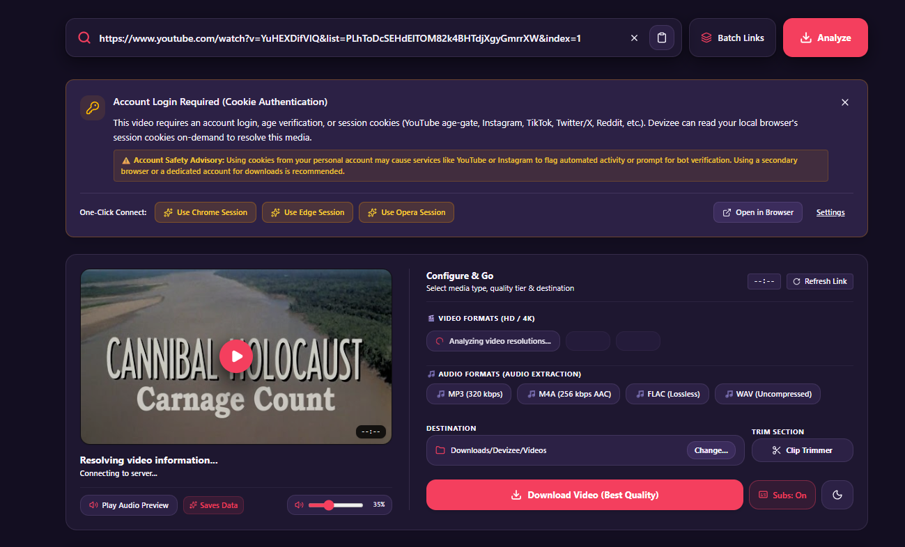
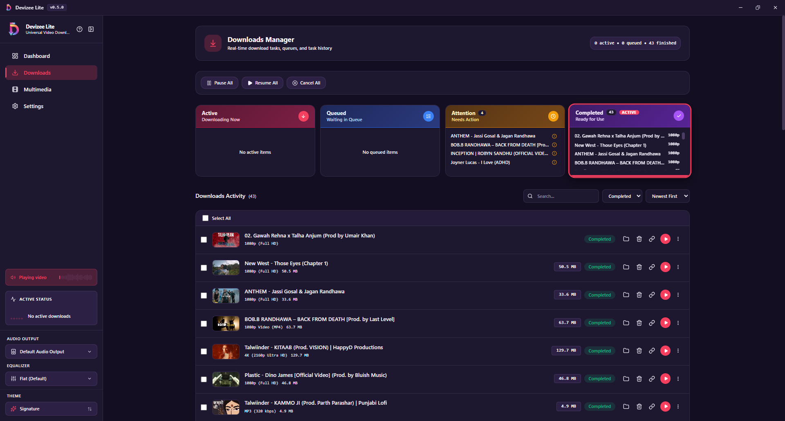
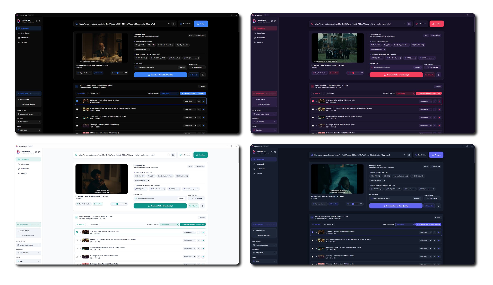
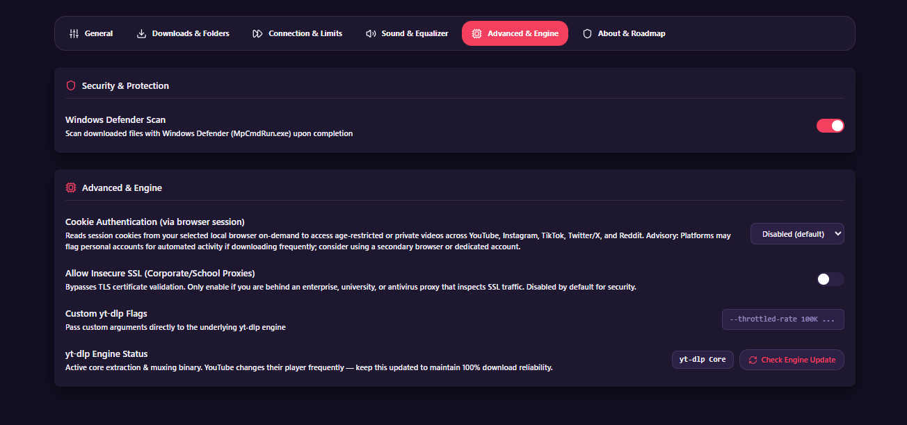
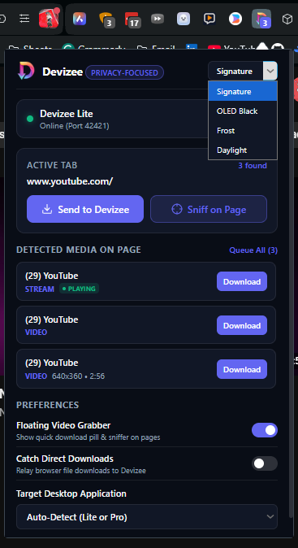
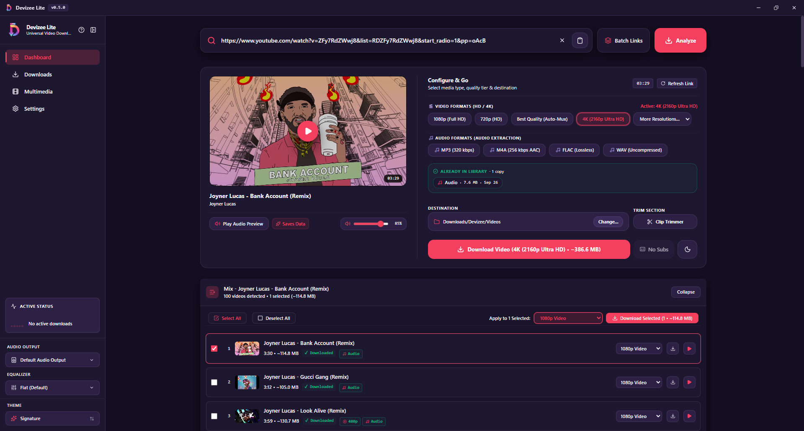
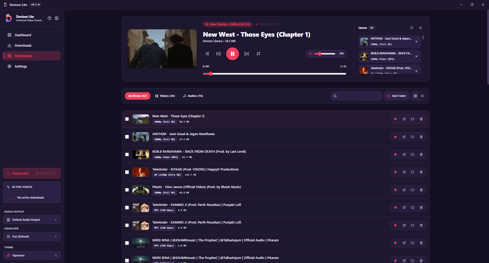
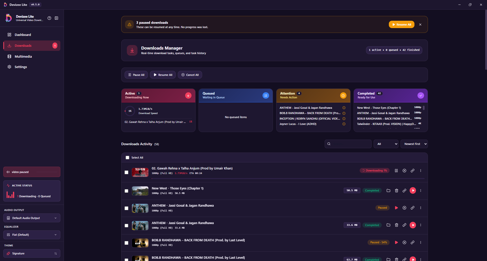
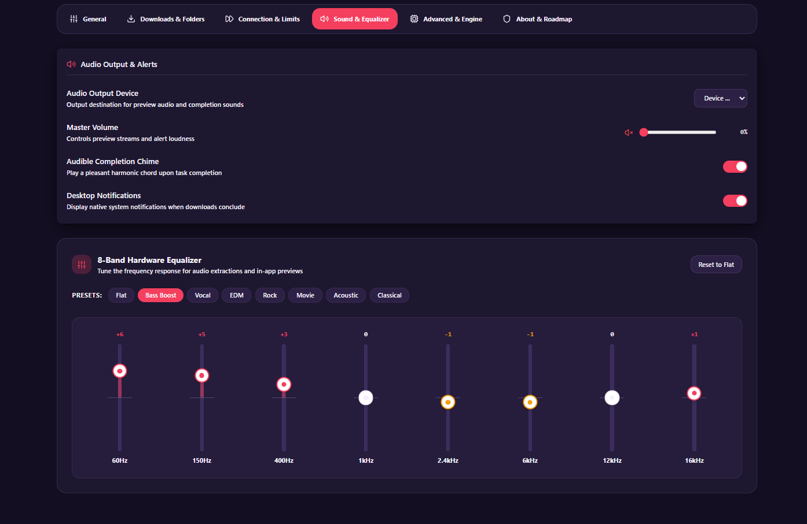

# Devizee Lite

**A fast, privacy-first desktop download manager and media player for Windows.**
Built with Tauri v2, Rust, React, and powered by `yt-dlp` + `ffmpeg`.

[](https://tauri.app/)
[](https://www.rust-lang.org/)
[](https://react.dev/)
[](https://www.typescriptlang.org/)
[](LICENSE)
[](#privacy)
[](https://github.com/Touseeef/devizee-lite-universal-video-downloader/releases)

---


---

## What is Devizee Lite?

Devizee Lite is a **native Windows desktop app** that downloads videos and audio from YouTube, TikTok, Instagram, Twitter/X, Facebook, Twitch, and 1,000+ other sites — with a modern UI, an 8-band equalizer, a built-in media player, and a **zero-telemetry, zero-ads, zero-nonsense** approach.

It is **not** Electron. It is a ~60 MB installer (which bundles the full ffmpeg and yt-dlp engines) that starts in under a second and does exactly what it says. It ships with a **companion browser extension** that sends any video straight to the desktop app with one click.

---

## Why Devizee?

Most download tools force a trade-off: pay for IDM, tolerate adware-adjacent "free" managers, or drop into yt-dlp's command line. Devizee Lite sits in the middle — modern GUI, no subscription, no telemetry, genuinely open source.

| Feature | **Devizee Lite** | IDM | 4K Video Downloader | yt-dlp CLI | JDownloader 2 |
|---|---|---|---|---|---|
| **Price** | Free, MIT | $25 one-time | Free (limited) / $15+ | Free | Free |
| **Open source** | ✅ MIT | ❌ | ❌ | ✅ | ✅ |
| **Zero telemetry** | ✅ | ❌ | ❌ | ✅ | Partial |
| **Ads / upsells** | None | Nag screens | Upsell banners | N/A | None |
| **Installer size** | ~60 MB | ~200 MB | ~180 MB | Python + deps | Java runtime |
| **Video sites** | 1,000+ (via yt-dlp) | Limited | YouTube / Vimeo | 1,000+ | 300+ |
| **Audio extraction** | MP3 / M4A / FLAC / WAV / Opus | ❌ | MP3 / M4A | ✅ | ✅ |
| **8-band hardware EQ** | ✅ | ❌ | ❌ | ❌ | ❌ |
| **Built-in media player** | ✅ with waveform | ❌ | Basic preview | ❌ | ❌ |
| **Clip-before-download** | ✅ | ❌ | ✅ (paid) | ✅ CLI | ❌ |
| **Batch playlists** | ✅ with per-track formats | Basic | ✅ (paid) | ✅ CLI | ✅ |
| **"Already downloaded" awareness** | ✅ | ❌ | ❌ | ❌ | ❌ |
| **Windows Job Object sandboxing** | ✅ | ❌ | ❌ | ❌ | ❌ |
| **Browser extension** | ✅ (Chromium) | ✅ | ✅ | ❌ | ✅ |
| **Platform** | Windows 10/11 | Windows | Win/Mac/Linux | All | All (Java) |
| **Updated** | Active | Slow | Active | Weekly | Active |

**Honest caveats about Devizee Lite:**
- Windows-only (macOS/Linux support is not planned for Lite; a future AIO release may add it)
- Installer is unsigned — Windows SmartScreen will warn on first run (click "More info" → "Run anyway")
- No BitTorrent support yet (planned for Devizee AIO)
- Companion browser extension is in public preview for Chromium browsers (Chrome, Edge, Brave, Opera, Vivaldi) — see [devizee-browser-extension](https://github.com/Touseeef/devizee-browser-extension). Firefox support is planned for v0.6.0.

See [COMPARISON.md](COMPARISON.md) for a deeper breakdown.

---

## Features

### 📥 Downloading
- **1,000+ supported sites** via yt-dlp — YouTube, YouTube Music, Shorts, TikTok, Instagram, Twitter/X, Facebook, Twitch, Vimeo, SoundCloud, and more
- **Playlist batch downloads** with per-track quality selection and one-click queue
- **Smart format selection** — resolution chips for 4K / 1440p / 1080p / 720p / 480p / 360p, with codec badges and estimated sizes
- **Audio extraction** to MP3 (320 kbps), M4A, FLAC (lossless), WAV, or Opus
- **Clip-before-download trimmer** — download only a specific section without fetching the whole file
- **Subtitle download** — extract manual or auto-generated subtitle tracks in SRT or VTT format alongside media
- **Dynamic MAX_PATH clamping** — automatic filename truncation to stay within Windows 260-character limits
- **Batch Links modal** — paste multiple URLs, import a `.txt` file, or load example links
- **Concurrent download limit** — runs 3 downloads at a time to prevent disk thrash; queue the rest
- **Auto-retry** for transient failures — silent, invisible to the user
- **Refresh URL** for expired download tokens — paste a fresh link, resume from the existing `.part` file
- **Interrupted download recovery** — resume after a crash, sleep, or forced shutdown
- **Browser companion extension** — send videos from Chrome, Edge, Brave, Opera, or Vivaldi straight to Devizee with one click ([repo](https://github.com/Touseeef/devizee-browser-extension))

### 🎵 Media & Playback
- **Built-in multimedia hub** — play downloaded audio and video without leaving the app
- **In-player subtitle tracks** — toggle and view downloaded subtitles directly inside the video player
- **8-band hardware equalizer** with presets (Flat, Bass Boost, Vocal, EDM, Rock, Movie, Acoustic, Classical)
- **Waveform visualizer** — hardware-accelerated canvas, 0% CPU when paused
- **Hardware audio output selector** — route audio to a specific DAC, headphones, or speaker
- **0ms YouTube preview** — click a thumbnail, video plays instantly
- **In-line audio preview** for bandwidth-conscious users
- **Full-screen theater mode** with Netflix-style queue drawer

### 🎨 Interface
- **Frameless native titlebar** — Windows 11-style draggable header with custom window controls
- **Close protection dialog** — if downloads are active when you close the app, choose to keep running, minimize to tray, or cancel everything
- **Welcome onboarding modal** — first-launch guide explaining core features, keyboard shortcuts, and cookie safety advisories
- **Paginated activity list** — smooth page navigation through large download histories
- **4 curated themes** — Signature, Light, Frost, and OLED (pure black)
- **IDE-style zoom** — `Ctrl+=`, `Ctrl+-`, `Ctrl+0`, persisted across sessions
- **Collapsible sidebar** with a clickable "Now Playing" pill
- **Responsive across window sizes** — from narrow split screens to 4K

### 🔒 Privacy & Engineering
- **Zero telemetry** — no analytics, no crash reporting, no pingbacks, no third-party proxies
- **Session & Sign-In Assistant** — when age-restricted or private videos need authentication, Devizee detects installed browsers and offers one-click session sync (Chrome, Edge, Firefox, Brave, Opera, Vivaldi)
- **In-app yt-dlp engine self-updater** — update the yt-dlp sidecar binary directly from Settings with automated SHA-256 fingerprint synchronization
- **Signed app auto-updater** — native auto-update engine powered by `tauri-plugin-updater` with Minisign Ed25519 signatures
- **Windows Job Objects** — every child process is bound to a job object with `KILL_ON_JOB_CLOSE`. Force-quitting Devizee or crashing never leaves zombie processes
- **Atomic `.part` staging** — files rename only after size + duration sanity checks pass
- **SQLite WAL mode & checkpointing** — throttled writes, proactive checkpointing, crash-safe
- **Corruption recovery** — if the database is corrupted, Devizee quarantines it and starts fresh rather than refusing to launch
- **Sidecar fingerprint verification** — SHA-256 hashing of yt-dlp and ffmpeg with tamper detection

---

## Product Showcase: Features That Sell

### ⚡ 1. Universal Media Ingestion & Smart Format Chips

> **Download any video or song in maximum quality without ads, speed caps, or deceptive pop-up traps.**

Paste a link from YouTube, TikTok, Instagram, Twitter/X, Facebook, Twitch, or 1,000+ sites. Devizee instantly analyzes the stream, displaying direct resolution chips (4K, 1440p, 1080p, 60fps), audio/video codecs (AV1, VP9, Opus), and estimated file sizes before you start.


- **1,000+ platforms supported** out of the box via sandboxed `yt-dlp`.
- **Zero speed throttling** — downloads saturate your full network bandwidth.
- **Audio extraction in 1-click** to MP3 (320 kbps), M4A, FLAC (lossless), WAV, or Opus.

---

### ✂️ 2. Pre-Download Time-Range Trimmer

> **Grab only what you need. Stop downloading 2-hour podcasts just for a 30-second clip.**

Drag the visual start and end sliders or type exact timestamps to clip any section before downloading. Devizee instructs the engine to fetch only that specific range, saving gigabytes of bandwidth and minutes of waiting.


- Engine-level range fetching (`--download-sections`) — no need to download the full file and trim it in heavy video editing software.
- High-precision scrubbing down to the exact second.

---

### 🎛️ 3. Built-in Multimedia Hub & 8-Band Hardware EQ

> **Play your downloads immediately. No need to install VLC or external media players.**

Devizee includes a complete local audio and video player with real-time waveform visualizers, playlist queues, and an 8-band hardware-accelerated equalizer with one-click presets (Bass Boost, EDM, Rock, Vocal, Movie).


- **8-Band Biquad Peaking Filter** (60 Hz to 15 kHz) with ±12 dB gain control.
- **Hardware audio output selector** — route audio directly to your DAC, headphones, or external speakers via `setSinkId`.
- **0ms YouTube Previews** — instant inline thumbnail playback with zero extraction wait.

---

### 💬 4. Subtitle Downloader & In-Player Caption Tracks

> **Keep dialogue accessible in any language.**

Automatically download embedded or auto-generated subtitle tracks (SRT / VTT). When playing videos in Devizee's integrated theater mode, toggle subtitles on or off and switch between language tracks on the fly.


- Fullscreen theater mode with Aspect Ratio toggling (Fit ↔ Fill / Ultrawide).
- Multi-language subtitle tracks saved directly alongside your media files.

---

### 📋 5. Batch Playlist Management & URL Import

> **Queue entire albums, channels, or link collections in seconds.**

Paste a playlist link to inspect every track with individual format controls and selective check-boxes, or bulk-import dozens of links via the Batch Links modal or `.txt` file import.


- Concurrency limiter keeps disk usage smooth (3 simultaneous downloads with queued backlog).
- Auto-resume and retry on dropped connections or expired CDN tokens.

---

### 🔐 6. Session & Sign-In Assistant

> **Age-restricted videos just work — without exposing your credentials.**

When YouTube or Instagram asks for a sign-in to view age-restricted or private content, Devizee detects which browsers are installed on your PC and offers a one-click session sync. No copying cookies by hand, no manual `cookies.txt` files.



- **Browser detection** — Devizee automatically detects Chrome, Edge, Firefox, Brave, Opera, and Vivaldi.
- **Local-only** — session cookies are read from your local browser profile and sent only to the source site. They never touch any Devizee server.
- **Account safety advisory** — Devizee warns you when a session sync could risk account flags, so you can use a secondary profile if desired.
- **DRM guardrails** — Netflix, Disney+, Prime Video, Hulu, and other DRM-protected services are cleanly detected and refused with an informative compliance message.

---

### 🪟 7. Frameless Native Titlebar & Close Protection

> **A Windows app that looks and behaves like a Windows app.**

No more generic "web app" chrome. Devizee uses a frameless custom titlebar with native-style window controls, drag regions, and integrated zoom indicators.



- **Close protection dialog** — if downloads are still running, Devizee intercepts the close action and asks: keep running, minimize to tray, or cancel everything.
- **Collapsible sidebar** with a "Now Playing" pill that jumps to your active media.
- **Theme-aware controls** — the titlebar re-colors to match Signature, OLED, Frost, or Light themes instantly.

---

### 🎨 8. Four Curated Visual Themes

> **A desktop app designed for modern workspaces.**

Switch instantly between 4 hand-crafted themes tailored for any lighting condition:
- **Signature**: Refined Plum & Rose accents.
- **Frost**: Slate-dark professional contrast.
- **OLED**: 100% pitch-black for OLED displays.
- **Light**: Crisp, high-contrast daytime mode.



---

### 🛡️ 9. One-Click Engine Self-Updater & Zero Telemetry

> **Always compatible with changing streaming platforms, 100% private.**

When YouTube or TikTok changes their streaming algorithms, update your core `yt-dlp` engine directly from **Settings → Advanced** in seconds — no need to reinstall the entire application.



- **Zero telemetry, zero analytics, zero pings** — your downloads stay strictly between your PC and the host site.
- **Automated SHA-256 fingerprint verification** protects against binary tampering.
- **Windows Job Object sandboxing** prevents zombie background processes.

---

## Browser Extension: The Fastest Way to Send Videos to Devizee

A companion extension for **Chrome, Edge, Brave, Opera, and Vivaldi** that talks directly to your local Devizee desktop app over `127.0.0.1`. No cloud, no relay servers, no account. Firefox support is planned for v0.6.0.

**Available at:** [github.com/Touseeef/devizee-browser-extension](https://github.com/Touseeef/devizee-browser-extension)

### 🌐 1. Crosshair Sniffer Mode

> **Point at any video on any page. Click to send it to Devizee.**

Forget hunting through page source code or hidden video links. Devizee's sniffer turns your cursor into a precision targeting reticle. As you hover over any element, Devizee instantly inspects it and highlights it if it contains downloadable media.


- **Live element badges** — hovering over a video, audio player, or media link shows an info badge (`VIDEO`, `AUDIO`, `STREAM`, `LINK`) with the destination host.
- **Glowing highlight box** — the target element lights up with a violet highlight so you know exactly what you're about to grab.
- **One-click capture** — click the highlighted element. A green success pulse confirms and the stream is sent to Devizee Desktop instantly.
- **`Escape` to exit** — cancel sniffer mode at any time without taking action.
- **Zero network requests** — the sniffer runs entirely in-page. It talks only to your local Devizee app.

---

### 📡 2. Multi-Media Radar & "Now Playing" Detector

> **Multiple videos on one page? Devizee finds them all — and tells you which one is playing.**

On pages like Twitter/X feeds, TikTok, Reddit threads, YouTube channels, and news articles, older downloaders get confused or only grab the first video. Devizee scans the full page and organizes every media element into a clean, actionable list.


- **"Now Playing" badge** — the currently playing video is marked with a green pulsing indicator, so you know exactly which stream you're grabbing.
- **Per-element controls** — each detected video has its own download button showing resolution and duration.
- **Queue All** — dispatch every video on a page into Devizee's desktop queue in one click.
- **Toolbar badge counter** — the extension icon shows how many media streams are ready to capture on the current tab (e.g., `3`).
- **Direct-to-dashboard** — clicking download instantly focuses Devizee and populates the URL, with formats already analyzed.

---

### 🎨 3. Full Theme Sync with Devizee Desktop

> **Your browser and your desktop app. Same look. Same feel.**

The extension ships with all four Devizee themes — Signature, OLED Black, Frost, and Daylight — and syncs your choice across the popup, the options page, the floating pill, and the desktop app.



- **One-click switching** — change your theme from the extension popup header and it applies instantly everywhere.
- **Options page preview cards** — interactively preview each theme before committing to it.
- **Consistent branding** — every element of the Devizee ecosystem respects your chosen look.

---

## Screenshots

> *(Add screenshots to `.github/assets/` and update the paths below)*

| Dashboard | Multimedia Hub |
|---|---|
|  |  |

| Downloads Queue | Settings — Sound & EQ |
|---|---|
|  |  |

---

## Installation

### Windows (recommended)
1. Download the latest installer from the [Releases page](https://github.com/Touseeef/devizee-lite-universal-video-downloader/releases):
   - **`Devizee-Lite-Setup-x.y.z.exe`** (NSIS installer — recommended)
   - or **`Devizee-Lite-x.y.z.msi`** (MSI installer)
2. Run the installer
3. On first launch, Windows SmartScreen may display an initial warning until reputation accumulates — click **"More info"** → **"Run anyway"**

> **Code Signing Notice:**
> This installer is currently unsigned. Windows SmartScreen will show a
> warning on first launch until the app builds download reputation. Click
> **"More info"** → **"Run anyway"** to proceed. Code signing is planned
> for a future release.

**System requirements:** Windows 10 (build 1809+) or Windows 11, ~150 MB free disk space. WebView2 is bundled with modern Windows.

### Browser Extension
The companion extension is available at [devizee-browser-extension](https://github.com/Touseeef/devizee-browser-extension). See that repo's README for install instructions (Chrome Web Store pending, manual install guide included).

### Build from source
```bash
# Prerequisites: Node.js 18+, Rust 1.78+, Tauri CLI
git clone https://github.com/Touseeef/devizee-lite-universal-video-downloader.git
cd devizee-lite-universal-video-downloader
npm install
npm run tauri dev
```

Production build:
```bash
npm run tauri build
```

Installers appear in `src-tauri/target/release/bundle/`.

---

## Privacy

Devizee Lite is built around a **privacy-first** philosophy:

- **No analytics.** No crash reporter phones home. No usage data leaves your machine.
- **No intermediary servers.** Media traffic goes directly from your PC to the source (YouTube, TikTok, etc.). Devizee does not proxy downloads.
- **No account required.** You never enter an email, name, or password into Devizee.
- **Cookie handling is local.** If you enable "Cookies from Browser" for age-restricted videos, yt-dlp reads them from your local browser profile and sends them only to the source site — exactly as your browser would. They are never sent to Devizee or any Devizee server.
- **Zero bundled bloatware.** No toolbars, no "recommended" software, no ad SDKs.

Read our full [PRIVACY.md](PRIVACY.md) and see [SECURITY.md](SECURITY.md) for the threat model and disclosure policy.

---

## Roadmap

### Devizee Lite (current line)
- ✅ **v0.3.0** — Stability, auto-retry, network recovery, duplicate detection
- ✅ **v0.4.0** — Sleep/watchdog detection, Refresh URL, DB corruption recovery, GitHub issue templates
- ✅ **v0.5.0** — Subtitle download + in-player tracks, in-app yt-dlp engine self-updater, SQLite WAL checkpointing, welcome onboarding modal, MAX_PATH dynamic clamp, paginated activity list, signed auto-updater, frameless titlebar, close-protection dialog
- ✅ **v0.5.1** — Companion browser extension in public preview (crosshair sniffer, multi-media radar, theme sync), session & sign-in assistant, reliable local bridge with origin validation, UI polish
- 🔄 **v0.6.0** — Firefox extension support (MV3 manifest adaptation), extension store submissions, additional site integrations, and further polish

### Devizee AIO — All-In-One Download Manager (separate product, in development)
A broader-scope download manager that will add:
- Multi-segment HTTP acceleration (IDM-class, 16–32 parallel chunk downloads)
- BitTorrent / P2P client with sequential streaming
- Smart content routing and MIME-type auto-sorting
- AcoustID / MusicBrainz audio fingerprinting and auto-tagging
- Advanced scheduling with auto-shutdown / sleep on completion
- Fake-4K / bitrate upscale detection

Follow the repo to see progress.

---

## Contributing

Contributions are welcome. Before opening a PR:
- Read [CONTRIBUTING.md](CONTRIBUTING.md)
- For bugs, use the [Bug Report template](.github/ISSUE_TEMPLATE/bug.md)
- For features, use the [Feature Request template](.github/ISSUE_TEMPLATE/feature.md)
- For questions, start a [Discussion](https://github.com/Touseeef/devizee-lite-universal-video-downloader/discussions)
- For security issues, use [private disclosure](https://github.com/Touseeef/devizee-lite-universal-video-downloader/security/advisories/new)

---

## License

MIT — see [LICENSE](LICENSE).

Devizee Lite bundles `yt-dlp` (Unlicense) and `ffmpeg` (LGPL/GPL as compiled) as sidecar binaries. Their licenses apply to those binaries respectively.

---

## Star History

If Devizee saves you time, a star helps other people find it.

[](https://star-history.com/#Touseeef/devizee-lite-universal-video-downloader&Date)