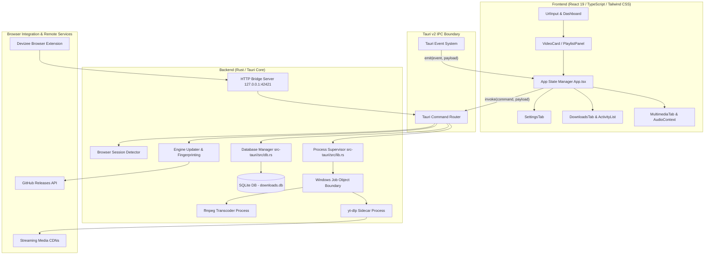

# Devizee Lite v0.5.0: Technical Architecture & Project Report

---

## 1. Executive Summary

### 1.1 What Devizee Lite Is
Devizee Lite is an open-source, local-first media download manager and multimedia playback application engineered specifically for the Windows desktop ecosystem. Built on top of the Tauri v2 framework, the software pairs a Rust backend process supervisor with a modern React/TypeScript frontend. It integrates battle-tested command-line multimedia extraction tools—specifically `yt-dlp` and `ffmpeg`—as sandboxed sidecar binaries to support media extraction from over 1,000 web platforms, including YouTube, TikTok, Instagram, Twitter/X, Facebook, Twitch, Vimeo, and SoundCloud.

### 1.2 Target Audience & Use Cases
Devizee Lite is designed for:
- **Media Consumers & Archival Enthusiasts**: Users seeking high-fidelity video (up to 4K/8K) and uncompressed or high-bitrate audio (MP3 320 kbps, M4A, FLAC, WAV, Opus) without subscription fees, commercial upsells, or web-based downloader risks.
- **Content Creators & Researchers**: Professionals who require specific segments of long broadcasts or live streams via precise time-range clipping before initiating a download.
- **Privacy-Conscious Individuals**: Users requiring zero telemetry, zero analytics tracking, strictly local database persistence, and transparent session authentication without credential storage.
- **Bandwidth-Constrained Users**: Environments with intermittent internet connectivity benefiting from resume capability, automated retry logic on transient dropped connections, and expired CDN token recovery.

### 1.3 Core Engineering Philosophy
- **Zero Telemetry**: No network pings, telemetry beacons, crash reporters, or third-party proxy relays exist within the application. All network connections are initiated directly between the user's host machine and target media hosts.
- **Process Containment**: Child worker processes (`yt-dlp`, `ffmpeg`) are governed via Windows Job Objects to eliminate orphan background processes upon crash or forced closure.
- **Atomic Operations**: File staging utilizes `.part` intermediate buffers and temporary directory segregation to prevent partial, unplayable, or corrupted files from appearing in the user's library.
- **Radical Transparency**: Cookie authentication for private or age-gated videos explicitly informs the user that local browser session cookies are utilized, accompanied by account automation advisories.

---

## 2. Technical Architecture

### 2.1 Component Separation

Devizee Lite enforces a strict boundary between UI presentation and native OS process management.



### 2.2 Frontend Architecture
- **Framework & Runtime**: React 19 bundled via Vite and `@tailwindcss/vite` in [`package.json`](file:///C:/Users/Anon/Documents/PROJECTS/devizee-lite/package.json).
- **Core View Controller**: [`src/App.tsx`](file:///C:/Users/Anon/Documents/PROJECTS/devizee-lite/src/App.tsx) coordinates URL analysis, download queue dispatch, playback transitions between in-app video and audio engines, theme application, window closing interception, and global zoom.
- **State Partitioning**:
  - Download state & active card tasks are managed via React component state hooks in [`src/App.tsx`](file:///C:/Users/Anon/Documents/PROJECTS/devizee-lite/src/App.tsx).
  - Web Audio graph state is isolated in [`src/lib/audioContext.ts`](file:///C:/Users/Anon/Documents/PROJECTS/devizee-lite/src/lib/audioContext.ts).
  - User configuration and local preferences are persisted across restarts via `localStorage`.
- **Audio Pipeline**: Utilizes the HTML5 Web Audio API in [`src/lib/audioContext.ts`](file:///C:/Users/Anon/Documents/PROJECTS/devizee-lite/src/lib/audioContext.ts). An 8-band biquad peaking filter chain routes media audio through a custom gain stage, real-time `AnalyserNode` for waveform generation, and physical device switching via `setSinkId`.

### 2.3 Backend Architecture
- **Rust Entrypoint**: [`src-tauri/src/main.rs`](file:///C:/Users/Anon/Documents/PROJECTS/devizee-lite/src-tauri/src/main.rs) and [`src-tauri/src/lib.rs`](file:///C:/Users/Anon/Documents/PROJECTS/devizee-lite/src-tauri/src/lib.rs).
- **Command Router**: Exposes asynchronous commands to the frontend via `tauri::generate_handler!`, including `fetch_video_info`, `start_download`, `cancel_download`, `get_download_history`, `check_engine_update`, `update_engine`, and `get_installed_browsers`.
- **Database Engine**: [`src-tauri/src/db.rs`](file:///C:/Users/Anon/Documents/PROJECTS/devizee-lite/src-tauri/src/db.rs) wraps `rusqlite` bundled with SQLite 3. Configures WAL (Write-Ahead Logging) mode, sets synchronous flag to `NORMAL`, and enforces a 5,000 ms busy timeout.
- **Sidecar Supervision**: Spawns external binaries located in `src-tauri/bin/` using `std::process::Command`. Standard output and standard error streams are processed line-by-line via asynchronous worker threads to parse progress percentages, speed metrics, and ETAs, which are emitted to the frontend as structured JSON events.
- **Loopback Extension Bridge**: An internal HTTP server spawned on `127.0.0.1:42421` in [`src-tauri/src/lib.rs`](file:///C:/Users/Anon/Documents/PROJECTS/devizee-lite/src-tauri/src/lib.rs). Allows browser extensions to dispatch download requests directly to the desktop app. It requires a 32-character authentication token generated per session and enforces browser extension origin verification (`chrome-extension://` or `moz-extension://`).

---

## 3. Feature Catalog

### 3.1 Media Ingestion & Extraction
- **Single Media Ingestion**: Direct URL resolution for video, audio, and live streams across supported platforms ([`src-tauri/src/lib.rs`](file:///C:/Users/Anon/Documents/PROJECTS/devizee-lite/src-tauri/src/lib.rs)).
- **YouTube Keyword Search**: Direct search queries using the `ytsearch5:` protocol without requiring a third-party API key ([`src-tauri/src/lib.rs`](file:///C:/Users/Anon/Documents/PROJECTS/devizee-lite/src-tauri/src/lib.rs), [`src/components/downloads/SearchResults.tsx`](file:///C:/Users/Anon/Documents/PROJECTS/devizee-lite/src/components/downloads/SearchResults.tsx)).
- **Playlist Batch Extraction**: Extracts complete playlist metadata into an interactive table, supporting individual format overrides, track exclusion checkboxes, and bulk queueing ([`src/components/downloads/PlaylistPanel.tsx`](file:///C:/Users/Anon/Documents/PROJECTS/devizee-lite/src/components/downloads/PlaylistPanel.tsx)).
- **Batch URL Modal & File Import**: Ingests lists of URLs via raw newline-separated text or direct `.txt` file parsing ([`src/components/downloads/BatchUrlModal.tsx`](file:///C:/Users/Anon/Documents/PROJECTS/devizee-lite/src/components/downloads/BatchUrlModal.tsx)).
- **Pre-Download Range Trimming**: Configures yt-dlp `--download-sections` to extract only specified timeframes (e.g. `*00:01:30-00:03:00`), bypassing the need to download the full media container ([`src/components/downloads/VideoCard.tsx`](file:///C:/Users/Anon/Documents/PROJECTS/devizee-lite/src/components/downloads/VideoCard.tsx), [`src-tauri/src/lib.rs`](file:///C:/Users/Anon/Documents/PROJECTS/devizee-lite/src-tauri/src/lib.rs)).
- **Subtitle Extraction**: Downloads embedded or auto-generated subtitle tracks (SRT/VTT) alongside the media file ([`src/components/downloads/VideoCard.tsx`](file:///C:/Users/Anon/Documents/PROJECTS/devizee-lite/src/components/downloads/VideoCard.tsx), [`src-tauri/src/lib.rs`](file:///C:/Users/Anon/Documents/PROJECTS/devizee-lite/src-tauri/src/lib.rs)).
- **Format Transcoding & Audio Extraction**: Converts video containers to audio formats (MP3 at 320 kbps, M4A, FLAC, WAV, Opus) utilizing `ffmpeg` post-processing ([`src/components/downloads/VideoCard.tsx`](file:///C:/Users/Anon/Documents/PROJECTS/devizee-lite/src/components/downloads/VideoCard.tsx), [`src-tauri/src/lib.rs`](file:///C:/Users/Anon/Documents/PROJECTS/devizee-lite/src-tauri/src/lib.rs)).

### 3.2 Playback & Audio Processing
- **Integrated Multimedia Hub**: Media management and playback interface for both local audio and video files ([`src/components/media/MultimediaTab.tsx`](file:///C:/Users/Anon/Documents/PROJECTS/devizee-lite/src/components/media/MultimediaTab.tsx)).
- **8-Band Hardware Equalizer**: Configurable peaking filter bands (60 Hz, 150 Hz, 400 Hz, 1 kHz, 2.4 kHz, 6 kHz, 12 kHz, 15 kHz) with ±12 dB range and 8 presets ([`src/lib/audioContext.ts`](file:///C:/Users/Anon/Documents/PROJECTS/devizee-lite/src/lib/audioContext.ts), [`src/components/common/VerticalEqSlider.tsx`](file:///C:/Users/Anon/Documents/PROJECTS/devizee-lite/src/components/common/VerticalEqSlider.tsx)).
- **Audio Output Routing**: Enumerates hardware sound devices and binds playback via `setSinkId` ([`src/components/common/AudioOutputDropdown.tsx`](file:///C:/Users/Anon/Documents/PROJECTS/devizee-lite/src/components/common/AudioOutputDropdown.tsx)).
- **Real-Time Waveform Visualizer**: Hardware-accelerated canvas visualizer driven by an `AnalyserNode`, throttled to 0% CPU consumption when playback is idle ([`src/components/common/WaveformVisualizer.tsx`](file:///C:/Users/Anon/Documents/PROJECTS/devizee-lite/src/components/common/WaveformVisualizer.tsx)).
- **Zero-Latency YouTube Previews**: Embeds YouTube iframe preview player for immediate playback prior to starting downloads ([`src/components/downloads/VideoCard.tsx`](file:///C:/Users/Anon/Documents/PROJECTS/devizee-lite/src/components/downloads/VideoCard.tsx)).

### 3.3 Operating System & Integration
- **Clipboard Radar (HUD Window)**: Auxiliary lightweight desktop window running in HUD mode to capture URLs copied to the system clipboard ([`src/components/hud/ClipboardHud.tsx`](file:///C:/Users/Anon/Documents/PROJECTS/devizee-lite/src/components/hud/ClipboardHud.tsx)).
- **Frameless Custom Titlebar**: Windows 11-style draggable header with window control hooks and zoom indicators ([`src/components/layout/TitleBar.tsx`](file:///C:/Users/Anon/Documents/PROJECTS/devizee-lite/src/components/layout/TitleBar.tsx)).
- **Multi-Theme Engine**: Four CSS custom-property color palettes (Signature, Light, Frost, OLED) ([`src/App.css`](file:///C:/Users/Anon/Documents/PROJECTS/devizee-lite/src/App.css), [`src/components/common/ThemeDropdown.tsx`](file:///C:/Users/Anon/Documents/PROJECTS/devizee-lite/src/components/common/ThemeDropdown.tsx)).
- **Signed App Updates**: Native updater using `@tauri-apps/plugin-updater` with Minisign Ed25519 verification against GitHub Releases ([`src-tauri/tauri.conf.json`](file:///C:/Users/Anon/Documents/PROJECTS/devizee-lite/src-tauri/tauri.conf.json), [`src/components/settings/SettingsTab.tsx`](file:///C:/Users/Anon/Documents/PROJECTS/devizee-lite/src/components/settings/SettingsTab.tsx)).
- **Engine Self-Updating**: Checks, downloads, and swaps the `yt-dlp` executable in-place from the official repository, automatically synchronizing its SHA-256 fingerprint ([`src-tauri/src/lib.rs`](file:///C:/Users/Anon/Documents/PROJECTS/devizee-lite/src-tauri/src/lib.rs), [`src/components/settings/SettingsTab.tsx`](file:///C:/Users/Anon/Documents/PROJECTS/devizee-lite/src/components/settings/SettingsTab.tsx)).

---

## 4. Failsafes & Error Handling

This section details how the codebase handles process failures, filesystem constraints, and network errors.

### 4.1 Windows Job Object Process Containment
- **Location**: [`src-tauri/src/lib.rs`](file:///C:/Users/Anon/Documents/PROJECTS/devizee-lite/src-tauri/src/lib.rs#L1321-L1350)
- **What It Literally Does**: On Windows, the application initializes a Win32 Job Object handle via `CreateJobObjectW` and applies `JOBOBJECT_EXTENDED_LIMIT_INFORMATION` configured with the flag `JOB_OBJECT_LIMIT_KILL_ON_JOB_CLOSE`. Every child process spawned for downloading or format analysis has its OS handle assigned to this job object via `AssignProcessToJobObject`.
- **Runtime Effect**: If Devizee Lite crashes, is terminated via Task Manager, or experiences a power outage, the Windows kernel terminates all active `yt-dlp` and `ffmpeg` sidecar processes assigned to that job object.
- **Limitations**: The call is gated behind `#[cfg(target_os = "windows")]`. If `AssignProcessToJobObject` fails, the error is ignored via `let _ = ...`, which could theoretically allow an unassigned process to remain orphaned if the assignment fails.

### 4.2 Safe Process Termination & PID Validation
- **Location**: [`src-tauri/src/lib.rs`](file:///C:/Users/Anon/Documents/PROJECTS/devizee-lite/src-tauri/src/lib.rs#L2408-L2430)
- **What It Literally Does**: When cancelling a download, the backend queries the target PID before executing `taskkill /F /PID <pid>`. It validates that the executable name associated with that PID contains `"yt-dlp"` or `"ffmpeg"`. If the process name does not match, the kill operation is aborted, and a log message is printed to stderr.
- **Runtime Effect**: Protects against killing unintended system or user processes if Windows recycles a PID between task creation and cancellation.
- **Limitations**: If the process terminates naturally immediately after the validation check but before `taskkill` runs, `taskkill` exits with an error status that the PID was not found.

### 4.3 Windows MAX_PATH (260 Character) Dynamic Clamping
- **Location**: [`src-tauri/src/lib.rs`](file:///C:/Users/Anon/Documents/PROJECTS/devizee-lite/src-tauri/src/lib.rs#L1010-L1017)
- **What It Literally Does**: Before generating output file paths, the code calculates the string length of the destination directory path (`dir_len`). It subtracts this from 240 (leaving 20 characters reserved for file extensions and temporary `.part` suffixes), clamps the resulting integer between 30 and 100 bytes, and replaces `%(title)s` with `%(title).<N>B` in the yt-dlp format template.
- **Runtime Effect**: Prevents `ERROR: unable to open for writing: [Errno 2] No such file or directory` caused by the standard 260-character Windows `MAX_PATH` path limit.
- **Limitations**: If the download directory itself has a length greater than 230 characters, the minimum clamp floor of 30 characters can still produce a full path exceeding 260 characters on systems without `LongPathsEnabled` registry configurations.

### 4.4 Startup Orphan Cleanup
- **Location**: [`src-tauri/src/lib.rs`](file:///C:/Users/Anon/Documents/PROJECTS/devizee-lite/src-tauri/src/lib.rs#L763-L844)
- **What It Literally Does**: During application startup, a background thread walks the configured download directory. It identifies any files matching the `.part` or `.ytdl` extension and queries their file modification timestamps. Any file whose last modified timestamp is greater than 48 hours in the past is deleted via `std::fs::remove_file`.
- **Runtime Effect**: Cleans up abandoned scratch files left behind by ungraceful shutdowns or interrupted tasks without manual user cleanup.
- **Limitations**: Files younger than 48 hours are preserved to avoid deleting active or recently paused downloads. Files located in subdirectories with restricted NTFS permissions will cause errors that are caught and ignored.

### 4.5 Sidecar Hash TOFU (Trust-On-First-Use) Verification
- **Location**: [`src-tauri/src/lib.rs`](file:///C:/Users/Anon/Documents/PROJECTS/devizee-lite/src-tauri/src/lib.rs#L133-L136), [`src/components/settings/SettingsTab.tsx`](file:///C:/Users/Anon/Documents/PROJECTS/devizee-lite/src/components/settings/SettingsTab.tsx)
- **What It Literally Does**: At launch, the backend calculates the SHA-256 hash of `yt-dlp.exe` and `ffmpeg.exe` and emits a `sidecar-fingerprint` event. The frontend stores these hashes in `localStorage` under `devizee_sidecar_hashes_v1`. On subsequent launches, the frontend compares the current hashes with the stored baseline. If a mismatch is detected without a user-triggered engine update, a warning modal alerts the user of potential binary tampering.
- **Runtime Effect**: Detects external modification or replacement of executable binaries on disk.
- **Limitations**: Because it is Trust-On-First-Use, if the binary was modified before initial launch, the baseline hash will record the modified binary as valid. Additionally, clearing browser/localStorage data resets the stored baseline.

### 4.6 SQLite WAL Checkpointing & Corruption Quarantine
- **Location**: [`src-tauri/src/db.rs`](file:///C:/Users/Anon/Documents/PROJECTS/devizee-lite/src-tauri/src/db.rs#L27-L108)
- **What It Literally Does**: `open_and_validate` executes `PRAGMA wal_checkpoint(PASSIVE)` followed by `PRAGMA quick_check(1)`. If opening or validation returns an error, the function captures the current Unix timestamp and renames `downloads.db`, `downloads.db-wal`, and `downloads.db-shm` to `downloads.db.corrupt.<timestamp>` (and corresponding WAL/SHM variants). It then creates a fresh `downloads.db` and initializes the schema.
- **Runtime Effect**: Prevents app startup crashes resulting from corrupted SQLite database files.
- **Limitations**: Corrupted records are not repaired; the user's historical download log is archived and reset to an empty state. If the target disk is full or read-only, creating the new database will fail.

### 4.7 Silent Transient Network Auto-Retry
- **Location**: [`src/App.tsx`](file:///C:/Users/Anon/Documents/PROJECTS/devizee-lite/src/App.tsx#L114-L123), [`src/App.tsx`](file:///C:/Users/Anon/Documents/PROJECTS/devizee-lite/src/App.tsx#L2240-L2270)
- **What It Literally Does**: When a download process exits with an error, the error message is checked against transient network error codes (`"network"`, `"unavailable"`). If the failure count for that URL is less than `AUTO_RETRY_MAX` (2), a retry is scheduled after a delay of `2000 * 2^attempt` milliseconds without alerting the user or marking the task as failed.
- **Runtime Effect**: Automatically recovers from intermittent network disconnects and brief server-side rate limits.
- **Limitations**: Only errors containing specific matching substrings trigger auto-retry. Permanent errors (e.g. 404 Not Found, video removed) or errors that do not match the parsed error patterns are treated as fatal.

### 4.8 Window Close Protection
- **Location**: [`src/App.tsx`](file:///C:/Users/Anon/Documents/PROJECTS/devizee-lite/src/App.tsx#L1188-L1205), [`src/components/common/CloseAppConfirmDialog.tsx`](file:///C:/Users/Anon/Documents/PROJECTS/devizee-lite/src/components/common/CloseAppConfirmDialog.tsx)
- **What It Literally Does**: Registers an event listener on `appWindow.onCloseRequested`. If any download record has status `"downloading"` or `"fetching"`, `event.preventDefault()` is invoked, and `CloseAppConfirmDialog` is rendered, offering options to keep running, minimize to system tray, or cancel all downloads and exit.
- **Runtime Effect**: Prevents accidental data loss or partial file creation caused by clicking the window close button.
- **Limitations**: Only intercepts standard window close requests; does not catch OS-level termination signals, system reboots, or hard crashes.

### 4.9 Expired CDN Stream URL Refresh
- **Location**: [`src/components/common/RefreshUrlDialog.tsx`](file:///C:/Users/Anon/Documents/PROJECTS/devizee-lite/src/components/common/RefreshUrlDialog.tsx), [`src/App.tsx`](file:///C:/Users/Anon/Documents/PROJECTS/devizee-lite/src/App.tsx)
- **What It Literally Does**: For downloads that stall or fail because the original CDN authentication token expired (common on long YouTube or TikTok downloads), the user can paste an updated URL. Devizee Lite passes the new URL to `yt-dlp` while retaining the existing destination filename and `.part` file.
- **Runtime Effect**: Allows large downloads to resume from existing partial bytes rather than re-downloading from 0%.
- **Limitations**: Requires the user to manually re-navigate to the source page, obtain a valid link, and paste it. If the server does not support HTTP Range requests, yt-dlp may still restart the file from byte 0.

### 4.10 React UI Error Boundary
- **Location**: [`src/ErrorBoundary.tsx`](file:///C:/Users/Anon/Documents/PROJECTS/devizee-lite/src/ErrorBoundary.tsx)
- **What It Literally Does**: Implements React `componentDidCatch` and `getDerivedStateFromError`. When an unhandled error is thrown in any component subtree during rendering, lifecycle methods, or constructors, it catches the error and displays a recovery card with error details and an "Application Reload" trigger.
- **Runtime Effect**: Prevents uncaught UI rendering exceptions from resulting in a blank white window.
- **Limitations**: Only intercepts exceptions within React rendering lifecycles; does not capture unhandled asynchronous promise rejections, background timer errors, or native Rust errors.

---

## 5. Video Tutorial & Documentation Walkthrough Outline

This modular tutorial outline is designed for multi-part video courses, technical demonstrations, or developer onboarding.

### Episode 1: Quickstart, Ingestion & Architecture Overview
- **Goal**: Introduce Devizee Lite, explain the Tauri v2 + Rust sidecar model, and run through a basic media download.
- **Topics**:
  - Launching Devizee Lite and navigating the frameless dashboard interface ([`src/components/layout/AppShell.tsx`](file:///C:/Users/Anon/Documents/PROJECTS/devizee-lite/src/components/layout/AppShell.tsx)).
  - Analyzing a video link: format chips, codec tags, and estimated file sizes ([`src/components/downloads/VideoCard.tsx`](file:///C:/Users/Anon/Documents/PROJECTS/devizee-lite/src/components/downloads/VideoCard.tsx)).
  - Direct YouTube keyword searches using the `ytsearch5:` pipeline ([`src/components/downloads/SearchResults.tsx`](file:///C:/Users/Anon/Documents/PROJECTS/devizee-lite/src/components/downloads/SearchResults.tsx)).
  - Understanding atomic `.part` file staging and destination management ([`src-tauri/src/lib.rs`](file:///C:/Users/Anon/Documents/PROJECTS/devizee-lite/src-tauri/src/lib.rs)).

### Episode 2: Advanced Download Features: Range Trimming & Subtitles
- **Goal**: Demonstrate how to trim specific media segments before downloading and extract subtitle tracks.
- **Topics**:
  - Using the visual trim slider and timestamp inputs in the VideoCard ([`src/components/downloads/VideoCard.tsx`](file:///C:/Users/Anon/Documents/PROJECTS/devizee-lite/src/components/downloads/VideoCard.tsx)).
  - How yt-dlp `--download-sections` extracts remote video segments without full-container buffering ([`src-tauri/src/lib.rs`](file:///C:/Users/Anon/Documents/PROJECTS/devizee-lite/src-tauri/src/lib.rs)).
  - Selecting and extracting multi-language subtitle tracks (SRT and VTT) ([`src/components/downloads/VideoCard.tsx`](file:///C:/Users/Anon/Documents/PROJECTS/devizee-lite/src/components/downloads/VideoCard.tsx)).
  - Verifying playback and track toggling in the Multimedia Tab player ([`src/components/media/MultimediaTab.tsx`](file:///C:/Users/Anon/Documents/PROJECTS/devizee-lite/src/components/media/MultimediaTab.tsx)).

### Episode 3: Batch Downloading, Playlists & Queue Management
- **Goal**: Cover high-volume workflow capabilities including playlist parsing and queue control.
- **Topics**:
  - Ingesting YouTube playlists and channel feeds into the Playlist Panel ([`src/components/downloads/PlaylistPanel.tsx`](file:///C:/Users/Anon/Documents/PROJECTS/devizee-lite/src/components/downloads/PlaylistPanel.tsx)).
  - Per-track selection, individual format overrides, and bulk queue dispatch ([`src/components/downloads/PlaylistPanel.tsx`](file:///C:/Users/Anon/Documents/PROJECTS/devizee-lite/src/components/downloads/PlaylistPanel.tsx)).
  - Importing URL lists from plain text files via the Batch URL Modal ([`src/components/downloads/BatchUrlModal.tsx`](file:///C:/Users/Anon/Documents/PROJECTS/devizee-lite/src/components/downloads/BatchUrlModal.tsx)).
  - Concurrency management, task pausing, and batch progress tracking ([`src/components/downloads/BatchProgress.tsx`](file:///C:/Users/Anon/Documents/PROJECTS/devizee-lite/src/components/downloads/BatchProgress.tsx)).

### Episode 4: Audio Engineering: Extraction, Hardware EQ & Output Routing
- **Goal**: Explore audio-only extraction modes and real-time Web Audio API signal processing.
- **Topics**:
  - Extracting high-bitrate MP3, M4A, FLAC, WAV, and Opus streams with metadata ([`src/components/downloads/VideoCard.tsx`](file:///C:/Users/Anon/Documents/PROJECTS/devizee-lite/src/components/downloads/VideoCard.tsx)).
  - Configuring the 8-band hardware equalizer and exploring sound presets ([`src/lib/audioContext.ts`](file:///C:/Users/Anon/Documents/PROJECTS/devizee-lite/src/lib/audioContext.ts), [`src/components/common/EqualizerDropdown.tsx`](file:///C:/Users/Anon/Documents/PROJECTS/devizee-lite/src/components/common/EqualizerDropdown.tsx)).
  - Inspecting audio analysis via the zero-CPU real-time Waveform Visualizer ([`src/components/common/WaveformVisualizer.tsx`](file:///C:/Users/Anon/Documents/PROJECTS/devizee-lite/src/components/common/WaveformVisualizer.tsx)).
  - Enumerating physical audio devices and dynamically switching outputs via `setSinkId` ([`src/components/common/AudioOutputDropdown.tsx`](file:///C:/Users/Anon/Documents/PROJECTS/devizee-lite/src/components/common/AudioOutputDropdown.tsx)).

### Episode 5: Authentication, Security & Anti-Bot Recovery
- **Goal**: Address age gates, private video restrictions, and platform security boundaries.
- **Topics**:
  - Why embedded webview sign-in fails and how local browser cookie authentication works ([`src-tauri/src/lib.rs`](file:///C:/Users/Anon/Documents/PROJECTS/devizee-lite/src-tauri/src/lib.rs), [`src/App.tsx`](file:///C:/Users/Anon/Documents/PROJECTS/devizee-lite/src/App.tsx)).
  - One-click browser session sync (Chrome, Edge, Brave, Firefox, Opera, Vivaldi) ([`src/App.tsx`](file:///C:/Users/Anon/Documents/PROJECTS/devizee-lite/src/App.tsx)).
  - Understanding account safety advisories and why secondary browser profiles are recommended ([`src/App.tsx`](file:///C:/Users/Anon/Documents/PROJECTS/devizee-lite/src/App.tsx)).
  - Handling DRM-protected content (Widevine/PlayReady) and compliance boundaries ([`src/App.tsx`](file:///C:/Users/Anon/Documents/PROJECTS/devizee-lite/src/App.tsx)).

### Episode 6: Engine Maintenance, Integrity & App Auto-Updates
- **Goal**: Demonstrate how Devizee Lite maintains long-term reliability against site changes.
- **Topics**:
  - The yt-dlp extractor lifecycle and running in-app engine self-updates ([`src-tauri/src/lib.rs`](file:///C:/Users/Anon/Documents/PROJECTS/devizee-lite/src-tauri/src/lib.rs), [`src/components/settings/SettingsTab.tsx`](file:///C:/Users/Anon/Documents/PROJECTS/devizee-lite/src/components/settings/SettingsTab.tsx)).
  - SHA-256 binary fingerprinting and TOFU tamper detection ([`src-tauri/src/lib.rs`](file:///C:/Users/Anon/Documents/PROJECTS/devizee-lite/src-tauri/src/lib.rs)).
  - Checking for signed desktop app releases via Minisign Ed25519 verification ([`src-tauri/tauri.conf.json`](file:///C:/Users/Anon/Documents/PROJECTS/devizee-lite/src-tauri/tauri.conf.json), [`src/components/settings/SettingsTab.tsx`](file:///C:/Users/Anon/Documents/PROJECTS/devizee-lite/src/components/settings/SettingsTab.tsx)).
  - Inspecting SQLite WAL checkpointing and database health ([`src-tauri/src/db.rs`](file:///C:/Users/Anon/Documents/PROJECTS/devizee-lite/src-tauri/src/db.rs)).

---

## 6. Build & Deployment Reference

### 6.1 Development Setup
```bash
# Clone the repository
git clone https://github.com/Touseeef/devizee-lite-universal-video-downloader.git
cd devizee-lite-universal-video-downloader

# Install Node dependencies
npm install

# Start development server with hot reload
npm run tauri dev
```

### 6.2 Production Compilation
```bash
# Build frontend assets and bundle native Windows executables (.msi and .exe)
npm run tauri build
```
Compiled bundle artifacts are output to `src-tauri/target/release/bundle/nsis/` and `src-tauri/target/release/bundle/msi/`.
